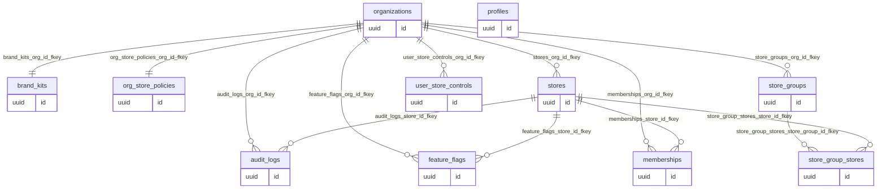
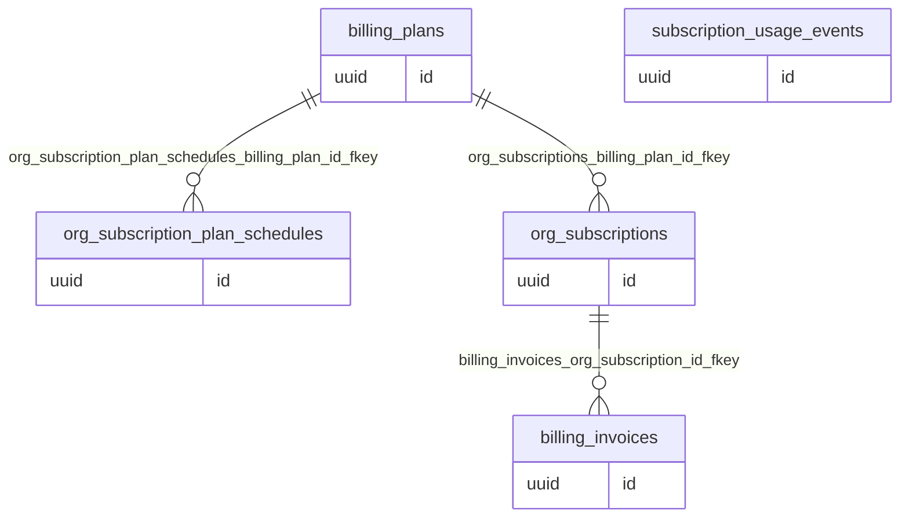
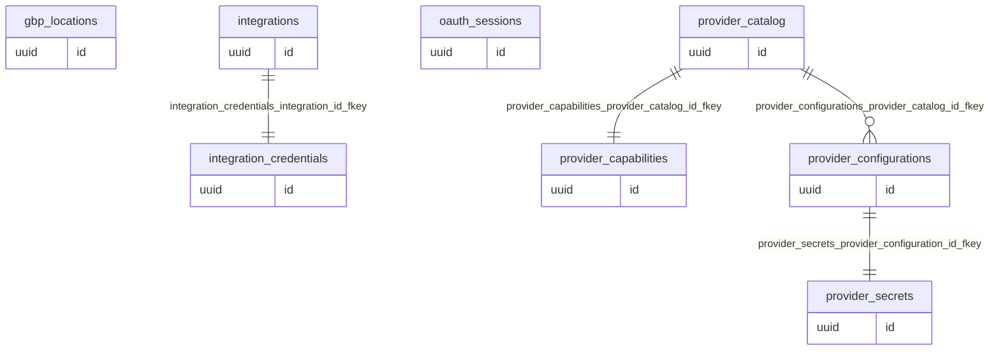

# TEPPEN MEO：Database ERD（Mermaid）

最終更新: 2026-02-13

このファイルは `npm run docs:erd` で再生成できます。

## Core（組織/ユーザー/店舗/設定）

組織・店舗・ユーザー・機能公開・監査の基盤データ。

含めるテーブル: audit_logs, brand_kits, feature_flags, memberships, org_store_policies, organizations, profiles, store_group_stores, store_groups, stores, user_store_controls

## Billing（契約プラン/請求）

プラン定義、組織契約、予約切替、利用実績、請求情報。

含めるテーブル: billing_invoices, billing_plans, org_subscription_plan_schedules, org_subscriptions, subscription_usage_events

## Integrations / OAuth（SNS連携）

連携カタログ、店舗連携設定、シークレット、OAuthセッション、資格情報。

含めるテーブル: gbp_locations, integration_credentials, integrations, oauth_sessions, provider_capabilities, provider_catalog, provider_configurations, provider_secrets

## Operations（投稿/受信箱/アンケート/順位/PWA）

日常運用データ（投稿、受信、アンケート、順位計測、PWA）。

含めるテーブル: competitor_metric_snapshots, competitor_targets, inbox_messages, inbox_reply_logs, inbox_threads, nap_alerts, nap_consistency_results, nap_consistency_runs, post_approval_comments, post_media, post_publish_logs, post_templates, posts, pwa_installations, rank_collection_results, rank_collection_runs, rank_keywords, survey_events, survey_responses, surveys

```mermaid
erDiagram
  competitor_metric_snapshots {
    uuid id
  }
  competitor_targets {
    uuid id
  }
  inbox_messages {
    uuid id
  }
  inbox_reply_logs {
    uuid id
  }
  inbox_threads {
    uuid id
  }
  nap_alerts {
    uuid id
  }
  nap_consistency_results {
    uuid id
  }
  nap_consistency_runs {
    uuid id
  }
  post_approval_comments {
    uuid id
  }
  post_media {
    uuid id
  }
  post_publish_logs {
    uuid id
  }
  post_templates {
    uuid id
  }
  posts {
    uuid id
  }
  pwa_installations {
    uuid id
  }
  rank_collection_results {
    uuid id
  }
  rank_collection_runs {
    uuid id
  }
  rank_keywords {
    uuid id
  }
  survey_events {
    uuid id
  }
  survey_responses {
    uuid id
  }
  surveys {
    uuid id
  }
  competitor_targets ||--o{ competitor_metric_snapshots : "competitor_metric_snapshots_competitor_target_id_fkey"
  inbox_messages ||--o{ inbox_reply_logs : "inbox_reply_logs_message_id_fkey"
  inbox_threads ||--o{ inbox_messages : "inbox_messages_thread_id_fkey"
  nap_consistency_results ||--o{ nap_alerts : "nap_alerts_last_result_id_fkey"
  nap_consistency_runs ||--o{ nap_alerts : "nap_alerts_last_run_id_fkey"
  nap_consistency_runs ||--o{ nap_consistency_results : "nap_consistency_results_run_id_fkey"
  posts ||--o{ post_approval_comments : "post_approval_comments_post_id_fkey"
  posts ||--o{ post_media : "post_media_post_id_fkey"
  posts ||--o{ post_publish_logs : "post_publish_logs_post_id_fkey"
  rank_collection_runs ||--o{ competitor_metric_snapshots : "competitor_metric_snapshots_run_id_fkey"
  rank_collection_runs ||--o{ rank_collection_results : "rank_collection_results_run_id_fkey"
  rank_keywords ||--o{ rank_collection_results : "rank_collection_results_rank_keyword_id_fkey"
  surveys ||--o{ survey_events : "survey_events_survey_id_fkey"
  surveys ||--o{ survey_responses : "survey_responses_survey_id_fkey"
```

